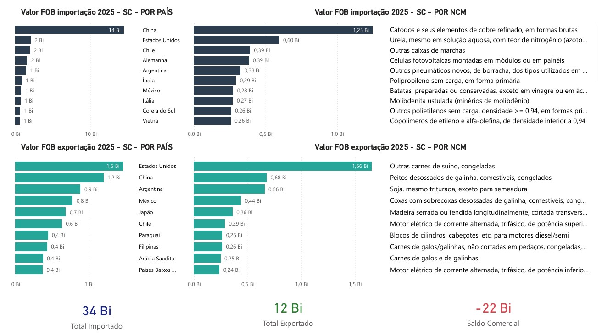

# ANÁLISE COMEX SC
Automação ETL em Python e Dashboard de Comércio Exterior (Santa Catarina - 2025)

# Análise de Comércio Exterior - Santa Catarina (2025) 

Projeto de Business Intelligence que automatiza a coleta de dados oficiais do ComexStat para monitorar a balança comercial catarinense.

#  Ferramentas
- **Linguagem**: Python (Pandas, Requests) para ETL automatizado.
- **Armazenamento**: Google Drive integrado via Cloud Link.
- **Visualização**: Power BI Desktop (DAX e Design de Dashboards).

# Pipeline de Dados
1. **Coleta**: Script Python extrai dados brutos diretamente do portal do governo.
2. **Processamento**: Limpeza e enriquecimento com nomes de produtos (NCM) e países.
3. **Distribuição**: O Power BI consome o arquivo tratado via nuvem, permitindo atualizações dinâmicas.

# Insights Principais 
- **Importação**: A China é o principal parceiro (US$ 14 Bi), destacando-se a compra de cátodos de cobre.
- **Exportação**: Carne de suíno congelada lidera as saídas, com EUA e China como principais destinos.
- **Balança**: Santa Catarina apresenta um perfil importador, com saldo de US$ -22 Bi no período.

---
*Projeto desenvolvido por Wagner Budal Arins.*
